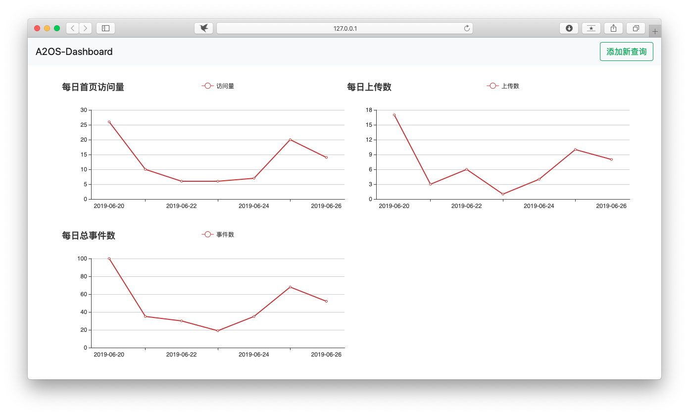

# A2OS Dashboard

## 项目介绍

该项目旨在为 SafeU 开发过程中引入的数据埋点服务 `behavior` 提供数据可视化服务

## 项目技术栈

- Flask
- ECharts

## Release Notes

[Release Notes](./release-notes.md)

## 效果预览

## Notice

本项目使用的数据库配置存放在 `db.conf` 中，可自行根据 `db.example.conf` 的示例进行创建
